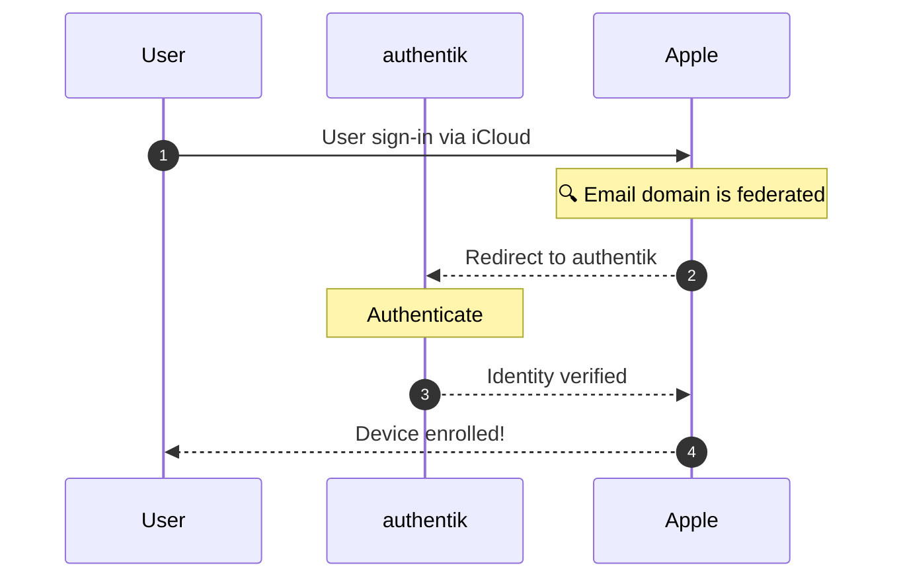

Support level: authentik

## What is Apple Business Manager?

Apple Business Manager is a web-based portal for IT administrators, managers, and procurement professionals to manage devices, and automate device enrollment.

Organizations using Apple Business Essentials can allow their users to authenticate into their Apple devices using their IdP credentials, typically their company email addresses.

### Apple School Manager

Apple School Manager is designed for educational institutions to manage devices, apps, and accounts. It integrates with Student Information Systems (SIS) to automatically create and manage Apple IDs for students and staff, while providing specialized features for classroom environments and educational workflows.

### Apple Business Essentials

Apple Business Essentials is a subscription-based service that combines device management, storage, and support into a single package for small businesses. Unlike Apple Business Manager, it includes built-in mobile device management capabilities without requiring third-party MDM solutions, making it ideal for organizations with limited IT resources.

:::tip

While this guide shows how to configure authentik as the identity provider for Apple Business Manager,
the same steps can be used to configure both Apple School Manager and Apple Business Essentials.

:::

## Authentication Flow

This sequence diagram shows a high-level flow between the user's MacBook, authentik, and Apple.

In short, Apple Business Manager recognizes the email domain
as a federated identity provider, eliminating the need for separate Apple ID credentials.

---

## Preparation

By the end of this integration, your users will be able to enroll their Apple devices using their authentik credentials.

You'll need to have authentik instance running and accessible on an HTTPS domain, and an Apple Business Manager user with the role of Administrator or People Manager.

:::warning{title="Caveats"}

Be aware that Apple Business Manager imposes the following restrictions on federated authentication:

- Federated authentication should use the user’s email address as their user name. Aliases aren’t supported.
- Existing users with an email address in the federated domain will automatically be converted to federated authentication, effectively _taking ownership_ of the account.
- User accounts with the role of Administrator, Site Manager, or People Manager can’t sign in using federated authentication; they can only manage the federation process.

:::

### Placeholders

The following placeholders are used:

- `authentik.company`: The Fully Qualified Domain Name of the authentik installation.

## Apple Business Manager Configuration

### Add and verify your domain

While Apple Business Manager does provide a reserved domain, you'll need to add your own [custom domain](https://support.apple.com/guide/apple-business-manager/add-and-verify-a-domain-axm48c3280c0/1/web/1) to use _Managed Apple Accounts_ with federated authentication.

:::info{title="Managed Apple Accounts"}

Similar to a user's personal Apple account, a _Managed Apple Account_ is created and managed by an organization, and can be used to access Apple services and devices. Both use an email address as the user name, but a _Managed Apple Account_ is owned by the organization, not the user.

:::

To add a custom domain, sign into Apple Business Manager dashboard and press your name on the sidebar, then select _Preferences_. From the preferences page, select _Managed Apple Accounts_ tab, and press _Add Domain_.

After providing your domain name, continue by pressing _Verify_. Apple will generate a DNS TXT record that you'll need to add to your domain's DNS settings. Once you've added the TXT record (and waited for DNS propagation), press _Verify_ to complete the process.

### Lock your domain

Upon successful domain verification, you must confirm a decision to lock your domain. [Locking your domain](https://support.apple.com/guide/apple-business-manager/lock-a-domain-axmce04f4299/1/web/) ensures that only your organization can use your domain for federated authentication.

:::danger{title="Consquences of locking a domain"}

Locking your domain affects all _enrolled_ users who login with an email address in the federated domain. The only way to unlock a domain is to remove it from Apple Business Manager, which until re-locking, will prevent them from accessing Apple services.

:::

### Capture all accounts

While optional, you can choose to [capture all accounts](https://support.apple.com/guide/apple-business-manager/capture-a-domain-axm512ce43c3/1/web/1), which will convert all existing accounts with an email address in the federated domain to _Managed Apple Accounts_.

:::danger{title="Account capture is permanent"}

Choosing to capture all accounts is an irreversible action which affects all users with an email address in the federated domain, regardless of their enrollment status. Once captured, the accounts can't be reverted to personal Apple IDs.

:::

## External References

- [Federated Authentication in Apple Business Manager](https://support.apple.com/guide/apple-business-essentials/federated-authentication-identity-provider-axmfcab66783/web)
- [Federated Authentication in Apple School Manager](https://support.apple.com/guide/apple-school-manager/federated-authentication-identity-provider-axmfcab66783/web)
